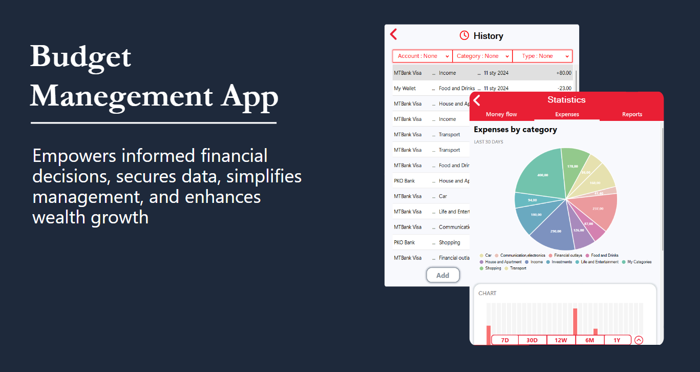

<h1 align="left">Hi 👋, I'm Maria</h1>
<h3 align="left">I am a software engineering student from Belarus</h3>

I am a student at the University of Lodz, Poland. I like programming and learning new things. I am currently looking for my passion, so I try to program in different programming languages ​​and try myself in everything. But I am mostly focused on C#.

  

**Talking about Personal Stuffs:**

- 🔭 I am a **Programming rookie**.
- 🏛 I’m currently studying at the **University of Lodz**.
- 🤔 One day I hope to...
          **go skydiving!**  
- 🤔 My hobbies are **cycling and reading foreign literature**.
- 💬 If you have any questions, **just ask me**.
- 📫 How to reach me : **maria.shyliankova@gmail.com**

<h3 align="left">Connect with me:</h3>

  
  
  
  
  
  
  

 

My last and coolest project "Budget management app" ❤️

&nbsp;

